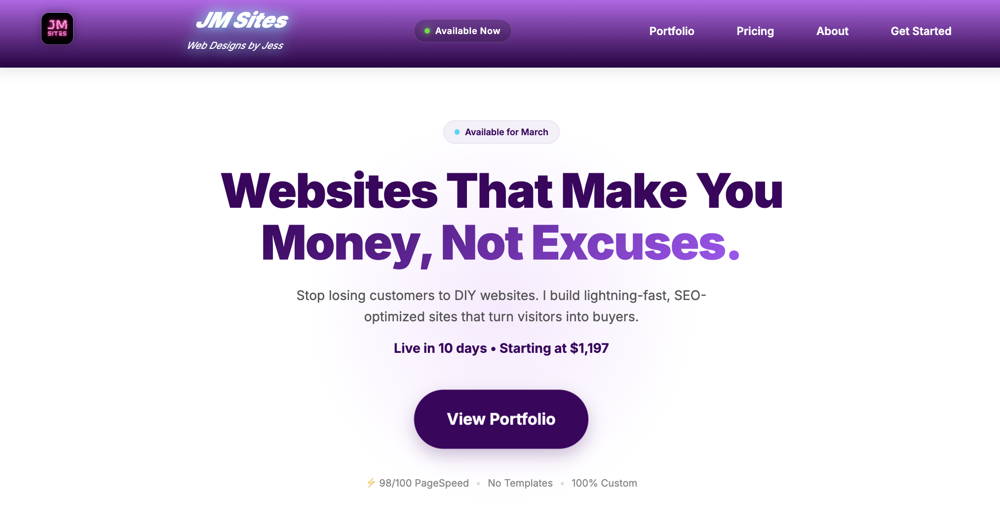

# JMSites
# 💜 JM Sites – Premium Web Design Portfolio

🔗 **Live Site:** [jmsites.vercel.app](https://jmsites.dev)

---

## 👋 About This Project

JM Sites is my personal freelance web design portfolio — a fully custom-built, lightning-fast website designed to attract premium clients and showcase my work.

**No templates. No WordPress. No page builders.** Just clean, hand-coded HTML, CSS, and JavaScript.

---

## ✨ Features

- ⚡ **98/100 PageSpeed Score** – optimised for performance
- 📱 **Fully Responsive** – Looks great on all devices
- 🔍 **SEO optimised** – Meta tags, Open Graph, semantic HTML
- ♿ **Accessible** – ARIA labels, keyboard navigation
- 🎨 **Custom Design** – No templates, 100% original
- 🚀 **Fast Deployment** – Hosted on Vercel/Netlify

---

## 🛠️ Built With

| Technology | Purpose |
|------------|---------|
| HTML5 | Semantic structure |
| CSS3 | Custom styling & animations |
| JavaScript | Interactivity |
| Google Fonts | Typography (Inter) |
| Vercel | Hosting & deployment |

---

## 📂 Project Structure

jmsites/
├── images/          # Project screenshots & assets
├── index.html       # Main HTML file
├── styles.css       # All styling
└── README.md        # You're reading it!

---

## 🎯 Portfolio Projects Featured

| Project | Description | Live Link |
|---------|-------------|-----------|
| Sydney Cleaning Pro | High-ticket cleaning service site | [View](https://sydney-cleaning-pro.vercel.app/) |
| Ibiza Cleaning | Local SEO-focused cleaning site | [View](https://ibiza-cleaning.vercel.app/) |
| Family Smiles Dental | Lead generation for dental practice | [View](https://familysmilesdental.netlify.app/) |

---

## 🚀 Quick Start

Want to run this locally?

# Clone the repo
git clone https://github.com/Jess-dev-93/jmsites.git

# Open in browser
open index.html

Or just use the VS Code Live Server extension!

---

## 📬 Let's Connect

I'm currently **available for freelance projects** and always happy to chat!

- 🌐 Website: [jmsites.vercel.app](https://jmsites.dev)
- 💼 LinkedIn: [jess-manning-dev](https://www.linkedin.com/in/jess-manning-dev)
- 📸 Instagram: [@jmsites.dev](https://www.instagram.com/jmsites.dev/)
- 📧 Email: jess.manning.dev@gmail.com

---

## 📄 License

This project is open source for learning purposes. Feel free to take inspiration, but please don't copy it directly. 

If you like it, give it a ⭐!

---

*Built with 💜 by Jess*
